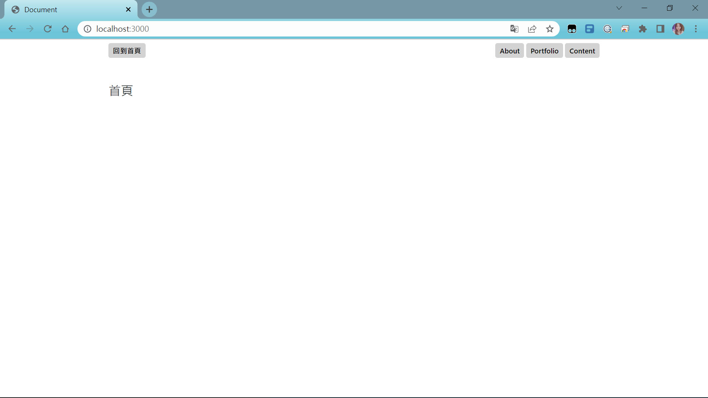

# AC\_ Q1: Express 基礎驗收



## 介紹

用 Express 製作的一支簡單的網頁應用，內容共有 4 個頁面：

- 首頁
- About
- Portfolio
- Contact

### 功能

- 當使用者點擊導覽列上的按鈕時，可以前往不同的頁面。

## 開始使用

1. 請先確認有安裝 node.js 與 npm
2. 將專案 clone 到本地
3. 安裝 npm 、 express 、 nodemon：

   ```bash
   npm install
   npm install express@4.16.4
   npm install -g nodemon
   ```

4. 安裝完畢後，繼續輸入：

   ```bash
   nodemon app.js
   ```

5. 若看見此行訊息則代表順利運行，打開瀏覽器進入到以下網址

   ```bash
   Listening on http://localhost:3000
   ```

6. 若欲暫停使用

   ```bash
   ctrl + c
   ```

## 開發工具

- Node.js 16.14.0
- nodemon 2.0.16
